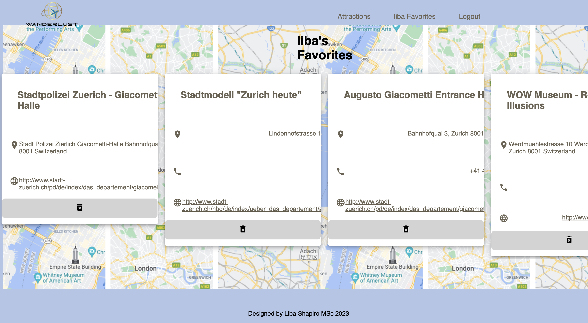

WANDERLUST - final project

Wanderlust is a Fullstack web app that allows users to easily find and save attractions all over the world.

Visit WANDERLUST (https://wanderlust.fly.dev/)

Architecture:  
Frontend: Next.js 13 as the frontend framework to build our web app.  
Backend: Node.js and Express.js to build the server-side of our app.  
Database: PostgreSQL as the database management system.  

Technologies Used:

- Next.js for server-side-rendering and Frontend development.
- PostgreSQL
- REST and Rapid API
- TypeScript / JavaScript
- React
- Node.js
- Figma
- DrawSQL
- Jest
- Playwright
- Fly.io

Visual Design of App:

Landing page:
 

Attractions page:
 

Favorites page:
 

Setup Instructions:  

- git clone the Github repo to your local machine
- Install Next.js yarn add create-next-app
- Setup the database by downloading and installing PostgreSQL
- Create a user and a database
- Copy the .env.example file to a new file called .env (this will be ignored from Git)
- Replace the ##### with username, password and name of your database
- Install dotenv-cli with yarn add dotenv-cli
- Run the migrations with yarn migrate up
- Finally, start the server by running yarn dev

Instructions for the Deployment:  

- Sign Up with Fly.io. Open the Fly.io Tokens page, generate a new Fly.io access token named Github Actions Deploy Token and copy it.
  Attention: Token will only be shown once!

- In the Github repo under Settings -> Secrets -> Actions, click New Repository secret and paste in the token in the token field and name the Token FLY_API_TOKEN.

- Once this step is done, on the command line in your terminal, authenticate with Fly.io so you can run commands in the command line: flyctl auth login. Login in the browser Window and then return back to the terminal. If this was successfull, a success message appears in the terminal.

- Now create an app, specifying the name using only lowercase letters and dashes: `flyctl apps create --name ``

- Add the database credentials using Fly.io secrets:  

  flyctl secrets set PGHOST=localhost PGDATABASE=upleveled$(openssl rand -hex 16) PGUSERNAME=upleveled$(openssl rand -hex 16) PGPASSWORD=$(openssl rand -base64 32)
  Next, create a 1GB volume for the PostgreSQL database in the Frankfurt Region: `flyctl volumes create postgres --size 1 --region fra`` 

- And finally, deploy the first version of the app: flyctl deploy
